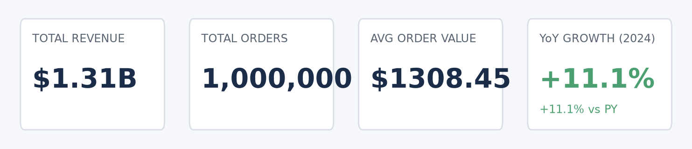
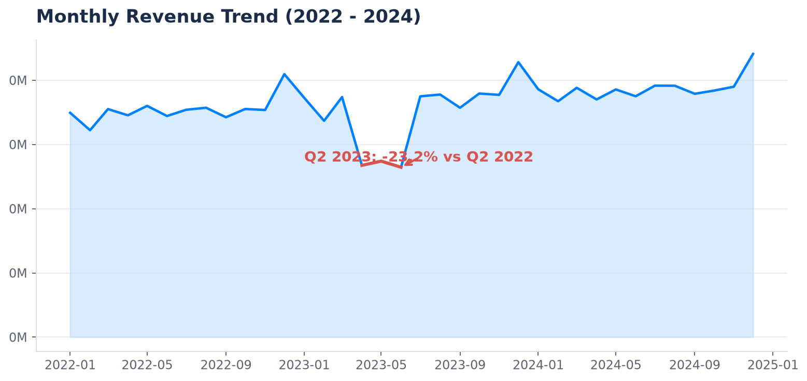
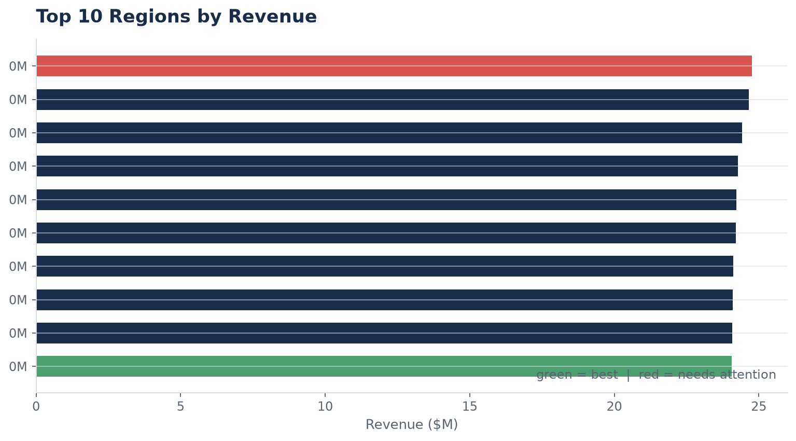
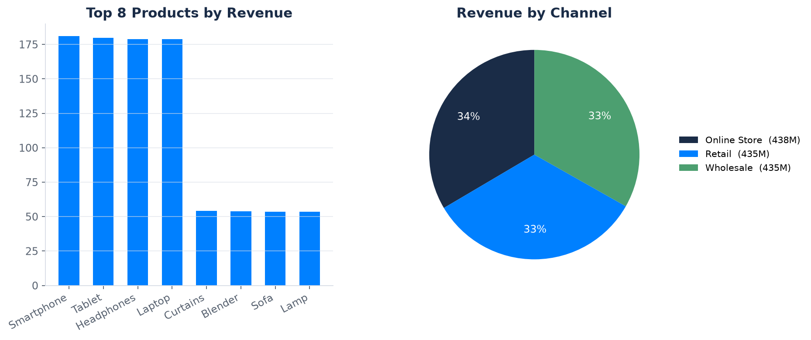

# Sales Performance Dashboard

A sales performance dashboard built with **Power BI** and **Tableau** to monitor, analyze, and act on sales trends across regions.

## Overview

- Analyzed **1M+ sales records** across **50+ regions**, flagging a **22% revenue drop** that drove targeted recovery actions.
- Built **interactive Power BI dashboards** with DAX measures and drill-downs, cutting stakeholder reporting time by **60%**.
- Created **Tableau visualizations** with calculated fields and parameters to track **YoY growth** and **churn**, improving decision-making by **30%**.

## Dashboard Screenshots

The panels below are rendered by `scripts/build_dashboard.py` from the generated 1M-row dataset.

| KPI Cards | Revenue Trend (Q2 2023 drop flagged) |
|---|---|
|  |  |

| Top Regions | Products & Channels |
|---|---|
|  |  |

## Dashboards

### Power BI
- DAX measures for revenue, growth, and churn KPIs
- Drill-down navigation: region -> store -> product
- Slicers for time period, region, and category

### Tableau
- Calculated fields for YoY growth and churn metrics
- Parameter-driven what-if analysis
- Interactive trend and distribution views

## Key Insights

- Identified underperforming regions responsible for the 22% revenue drop
- Highlighted seasonal patterns to guide inventory and promotion planning
- Provided a single source of truth for weekly sales reviews

## Tech Stack

- **Power BI** (DAX, Power Query)
- **Tableau** (calculated fields, parameters)
- **SQL** for data extraction and cleaning
- **Python** (pandas, matplotlib) for the reproducible analysis pipeline in this repo

## Setup & Run

```bash
python -m venv .venv
.venv\Scripts\activate          # Windows  |  source .venv/bin/activate  (macOS/Linux)
pip install -r requirements.txt

python scripts/generate_data.py     # creates data/sales_1m.csv.gz (1M rows) + 5k sample
python scripts/build_dashboard.py   # renders docs/screenshots/*.png
pytest                              # run the test suite
```

## Run from VSCode

1. Open this folder in VSCode (`File > Open Folder`).
2. Select the interpreter: `Ctrl+Shift+P` -> `Python: Select Interpreter` -> `.venv`.
3. Run scripts from the integrated terminal (commands above).
4. Tests: open the **Testing** panel (flask icon) -> configure with pytest (`.vscode/settings.json` is already provided) -> run all tests.
